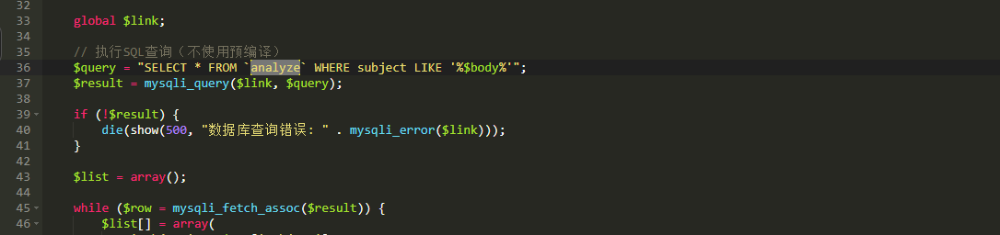
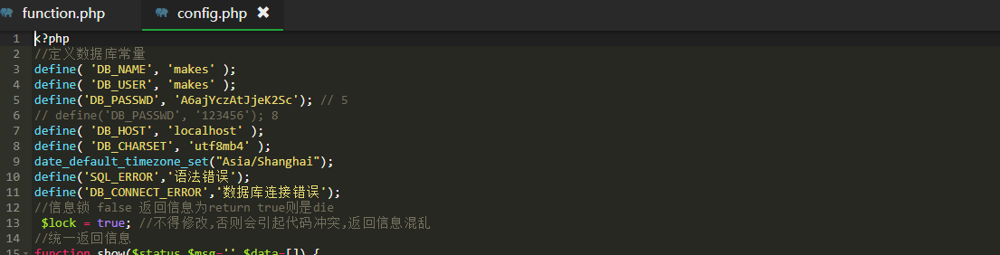
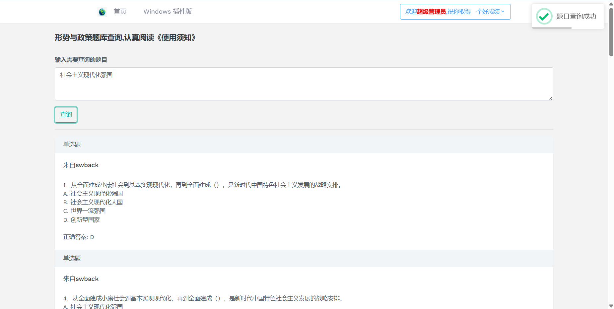
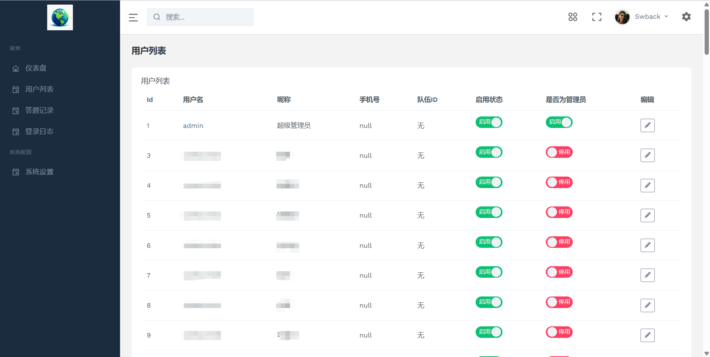
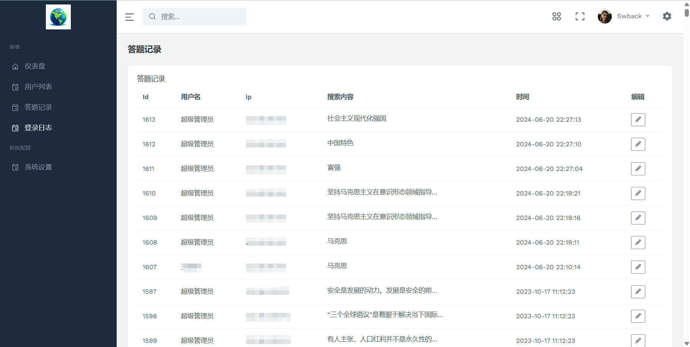
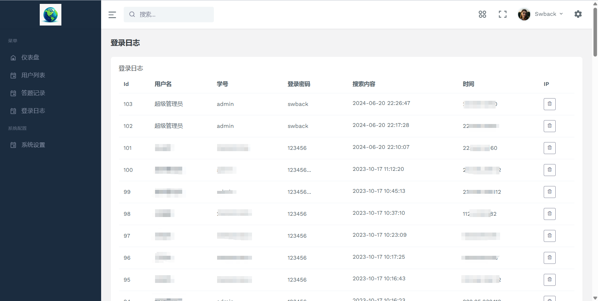

<<<<<<< HEAD
# makes
形势与政策与马克思题目在线查询网站
=======
> **系统未做安全性保护,强烈建议以docker形式部署。**

# 系统功能

在线登录

后台管理

题目查询

油猴插件

# 后台账号

| 账户  | 密码   | 权限       |
| ----- | ------ | ---------- |
| admin | swback | 超级管理员 |
| test  | swback | 普通用户   |

# 部署环境

## 方式一: 直接部署

推荐: `nginx1.18` + `php72`+`MySQL5.6`

## 方式二: Docker拉取-强烈推荐

# 数据配置

## 题库切换

数据库中存在`马克思` and `形式与政策` 两个题库，如果需要切换题库,请修改`function.php` 第36行,将`analyze` 修改为`marks`即可

## 数据库配置

修改config.php文件,填写数据库账户，密码,数据库名

# 系统截图

>>>>>>> 97d9188 (源码提交)
